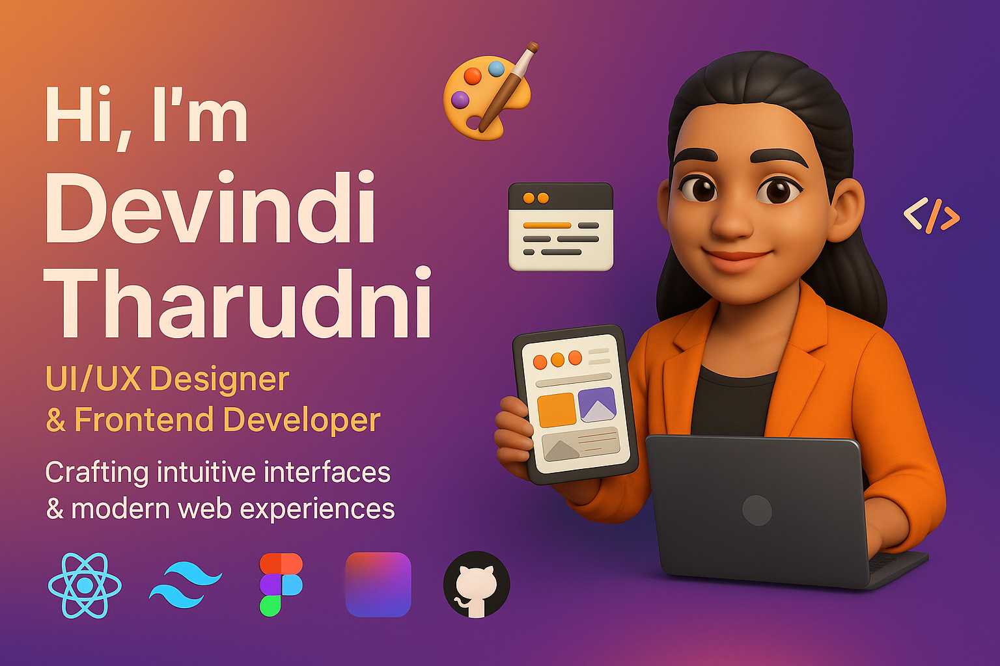

<p align="center">
  
</p>

<h1 align="center">
  
</h1>

<p align="center">
  <b>🧠 Curious thinker · 🎨 Pixel-perfectionist · 💻 Code-lover · ☕ Fueled by creativity</b>
</p>

---

## 🧩 About Me

```yaml
name: Devindi Tharudni
role: UI/UX Designer & Frontend Developer
location: Homagama, Sri Lanka 🇱🇰
email: devinditharudini07@gmail.com
portfolio: http://my-portfolio-ebon-six-77.vercel.app
interests: [design systems, accessibility, micro-interactions, animation, UX research]
```

- 👩‍🎓 Graduate in Computer Science (University of Plymouth)
- 💡 I build human-centered UI & scalable, responsive web frontends
- 🌱 I’m growing into motion design and system architecture
- 🔍 Passionate about empathy-driven design & clean coding practices

---

## 🛠️ My Design & Dev Toolbox

<p align="center">
  
</p>

---

## 📊 GitHub at a Glance

<p align="center">
  
  
  <br><br>
  
</p>

---

## 🌐 Connect with Me

<p align="center">
  <a href="mailto:devinditharudini07@gmail.com">
    
  </a>
  <a href="https://www.linkedin.com/in/devindi-tharudini/" target="_blank">
    
  </a>
  <a href="http://my-portfolio-ebon-six-77.vercel.app" target="_blank">
    
  </a>
</p>

---

## ✨ UX & Code Beliefs

> “Design isn’t just how it looks — it’s how it works.” 
> *– Steve Jobs*

- Make it usable before making it beautiful  
- Accessibility is not optional  
- Good UX = less confusion = more joy

---

## 🪄 Fun Snippet

```css
.designer::before {
  content: "🎨 Sketching empathy into interfaces";
}
.developer::after {
  content: "💻 Translating visuals into clean, scalable code";
}
```

---

<p align="center">
  
</p>
